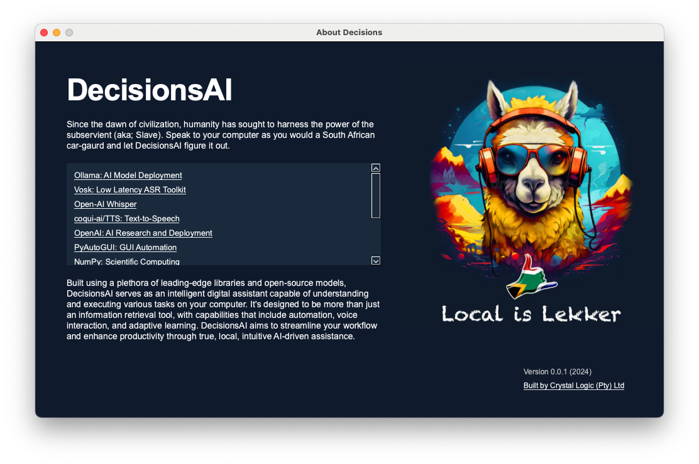

# DecisionsAI

DecisionsAI is an intelligent digital assistant designed to understand and execute various tasks on your computer. It leverages cutting-edge AI technologies to provide voice interaction, automation, and adaptive learning capabilities.

> **IMPORTANT**: This project is currently in an experimental stage and not fully functional. It is actively being developed and updated. Contributions are deeply encouraged and welcome!



> **WARNING**: This project currently requires significant memory resources to run. While optimization efforts are ongoing, including plans to make it compatible with a Raspberry Pi 5, it is currently being developed on an Apple M3 Max with 32GB of RAM. 

> The AI models used in this project collectively consume at least 6GB of memory. Therefore, it is strongly recommended to run DecisionsAI on a machine with a minimum of 16GB of RAM for optimal performance.

> Please note that future updates will focus on reducing the memory footprint and improving efficiency across various hardware configurations and there will be a fallback to smaller models, or API's if the system resources are too low.

> This project is predominately in English, but multilingual support is deeply desired.


<p align="center">
  
</p>


## Vision

Our goal is to create a system assistant that:
- Has context of your system
- Does not get in your way
- Actually accelerates your work

## Features

- Voice-controlled AI assistant
- Task automation and computer control
- Natural language processing
- Text-to-speech and speech-to-text capabilities
- Customizable actions and commands
- Chat interface for text-based interactions (broken)
- Multi-model AI support (Ollama, OpenAI, Anthropic)

## Installation

1. Clone the repository:
   ```bash
   git clone https://github.com/yourusername/DecisionsAI.git
   ```

2. Install dependencies:
   ```bash
   brew install portaudio
   pip install -r requirements.txt
   ```

3. Run the setup script to download the models:
   ```bash
   python setup.py
   ```

## Usage

1. Start the assistant:
   ```bash
   python start.py
   ```

2. Interact with the assistant using voice commands or the chat interface (broken).

## Contributing

We welcome contributions to DecisionsAI! If you have suggestions or improvements, please open an issue or submit a pull request.

## Future Development

This project is a work in progress and will continue to be updated. We aim to make it more robust and powerful, especially when it comes to handling larger projects.

## Other Scripts

Using Open-Interpreter, I've created a little script called `agent` that carries out tasks on your local machine:

```bash
python ./scripts/agent.py
```

When prompted, try entering a command like:
"Create a new text file on my desktop called vegetables.txt and put a list of 15 vegetables in it. Then open the file."

Watch what happens :)

## Voice Commands

DecisionsAI responds to a wide range of **__voice commands__**. 

Here's a comprehensive list of available commands:

### Navigation and Window Management

| Command | Description |
|---------|-------------|
| Open / Focus / Focus on | Open or focus on a specific window |
| Open file menu | Open the file menu |
| Hide oracle / Hide globe | Hide the oracle/globe interface |
| Show oracle / Show globe | Show the oracle/globe interface |
| Change oracle / Change globe | Change the oracle/globe interface |
| Open GPT | Open GPT (Alt+Space shortcut) |
| Open spotlight / Spotlight search | Open Spotlight search (Cmd+Space) |
| New tab | Create a new tab (Cmd+T) |
| Previous tab | Switch to the previous tab (Cmd+Alt+Left) |
| Next tab | Switch to the next tab (Cmd+Alt+Right) |
| Close | Close the current window (Cmd+W) |
| Quit | Quit the current application (Cmd+Q) |

### Text Editing and Navigation

| Command | Description |
|---------|-------------|
| Copy | Copy selected text (Cmd+C) |
| Paste | Paste copied text (Cmd+V) |
| Cut | Cut selected text (Cmd+X) |
| Select all | Select all text (Cmd+A) |
| Undo | Undo last action (Cmd+Z) |
| Redo | Redo last undone action (Cmd+Shift+Z) |
| Back space / Backspace | Delete character before cursor |
| Delete | Delete character after cursor |
| Clear line | Clear the current line |
| Delete line | Delete the entire line (Cmd+Shift+K) |
| Force delete | Force delete (Cmd+Backspace) |

### Cursor Movement

| Command | Description |
|---------|-------------|
| Down / Up / Left / Right | Move cursor in specified direction |
| Page up / Page down | Scroll page up/down |
| Home | Move cursor to beginning of line |
| End | Move cursor to end of line |
| Back | Move cursor back (Cmd+Left) |

### Mouse Control

| Command | Description |
|---------|-------------|
| Mouse up/down/left/right | Move mouse in specified direction |
| Mouse slow up/down/left/right | Move mouse slowly in specified direction |
| Move mouse center/middle | Move mouse to center of screen |
| Move mouse vertical middle | Move mouse to vertical middle of screen |
| Move mouse top/bottom | Move mouse to top/bottom of screen |
| Move mouse left/right of screen | Move mouse to left/right edge of screen |
| Right click | Perform a right-click |
| Click | Perform a left-click |
| Double click | Perform a double left-click |
| Scroll up/down | Scroll the page up/down |

### System Controls

| Command | Description |
|---------|-------------|
| Refresh / Reload | Refresh the current page (Cmd+R) |
| Pause / Stop / Play | Control media playback |
| Next track / Previous track | Switch between tracks |
| Mute | Mute audio |
| Volume up / Volume down | Adjust volume |

### Function Keys

| Command | Description |
|---------|-------------|
| Press F1 through Press F12 | Press the corresponding function key |

### Special Keys

| Command | Description |
|---------|-------------|
| Space bar / Space / Spacebar | Press the space bar |
| Control | Press the Control key |
| Command | Press the Command key |
| Enter this | Press the Enter key |
| Press alt / Alt | Press the Alt key |
| Press escape / Escape / Cancel | Press the Escape key |
| Tab | Press the Tab key |

### AI Assistant Interactions (THIS IS STILL A WORK IN PROGRESS)

| Command | Description |
|---------|-------------|
| Dictate | Start dictation mode |
| Transcribe / Listen / Listen to | Start transcription mode |
| Read / Speak / Recite / Announce | Read out the transcribed text |
| Agent / Hey / Jarvis | Activate the AI agent for complex tasks |
| Explain / Elaborate | Ask for an explanation or elaboration |
| Calculate / Figure out / Analyze | Perform calculations or analysis |
| Translate | Translate text to another language |

### Miscellaneous

| Command | Description |
|---------|-------------|
| Copy transcription | Copy the transcribed text |
| Action | Perform a custom action |
| Snippet | Insert a predefined text snippet |

### Control Commands

| Command | Description |
|---------|-------------|
| Start listening / Listen / Listen to | Begin voice command recognition |
| Stop listening / Stop / Halt | Stop voice command recognition |
| Stop speaking / Shut up / Be quiet | Stop the AI from speaking |
| Exit | Exit the application |

Note: Some commands may have multiple variants or trigger words. The AI assistant is designed to understand natural language, so slight variations in phrasing may also work.

> **WARNING**: The AI assistant is not perfect and may not understand all commands. The ability to "transcribe" , "translate" and "dictate" is still somewhat flaky, and prone to break and bug out. Work in progress.

## License

This project is licensed under the CRYSTAL LOGIC (PTY) LTD COMMUNITY LICENSE AGREEMENT. See the [LICENSE.md](LICENSE.md) file for details.
